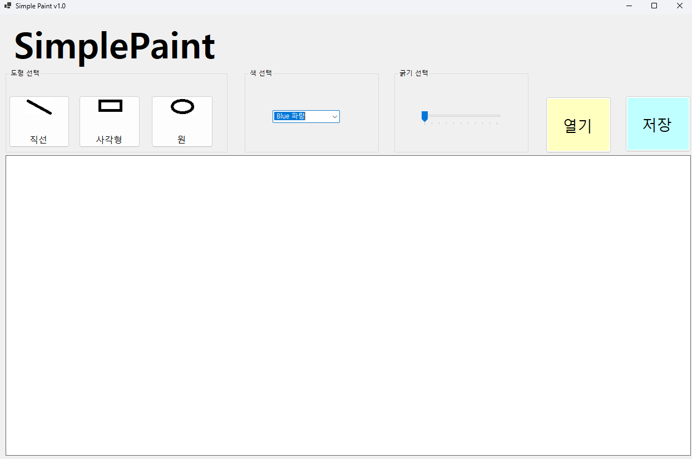
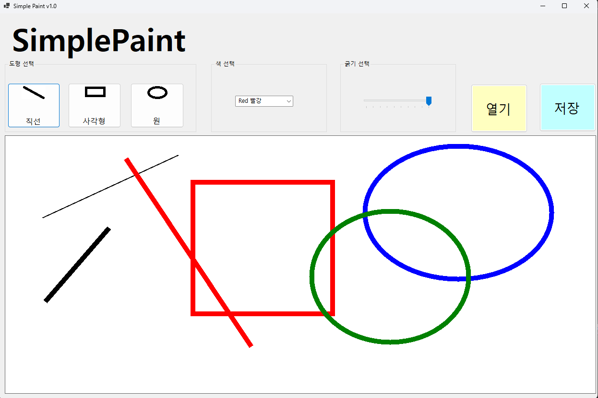
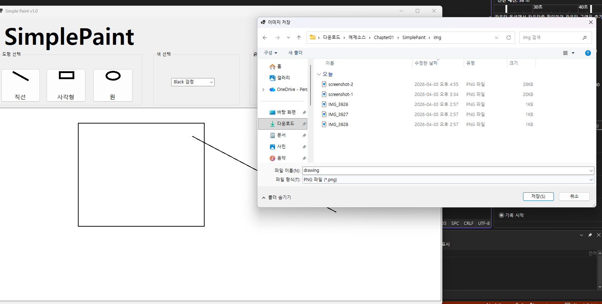
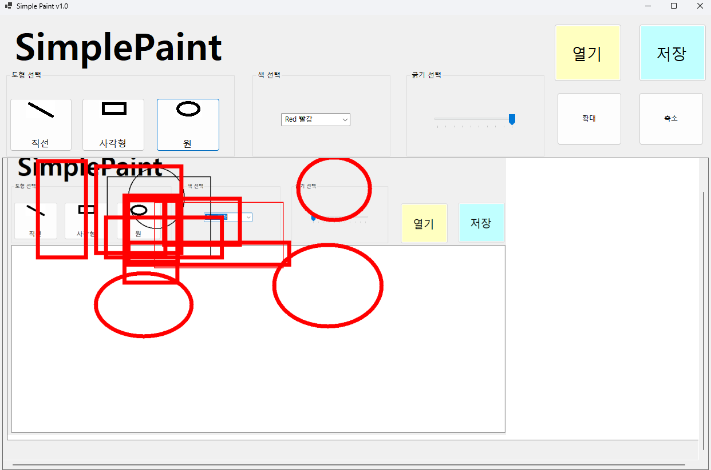

# (C# 코딩) SimplePaint

## 개요
- C# 프로그래밍 학습
- 1줄 소개: 마우스를 이용하여 도형을 그리고 색상과 선 두께를 설정할 수 있는 그림판 프로그램

- 사용한 플랫폼: 
  - C#, .NET Windows Forms, Visual Studio, GitHub

- 사용한 컨트롤:
  - Label, Button, ComboBox, TrackBar, PictureBox, GroupBox

- 사용한 기술과 구현한 기능:
  - Visual Studio를 이용하여 UI 디자인
  - enum을 이용한 도형 선택 상태 관리 (직선, 사각형, 원)
  - ComboBox를 이용한 색상 선택 기능 구현
  - TrackBar를 이용한 선 두께 조절 기능 구현
  - PictureBox를 이용한 캔버스 구성
  - Bitmap과 Graphics 객체를 이용한 그림 그리기 구조 구현
  - 마우스 이벤트(MouseDown, MouseMove, MouseUp)를 이용한 드래그 처리 기반 설계
---

## 실행 화면 (과제1)

- 구현한 내용 ( 위 그림 참조)
  - UI 구성: 도형선택,색선택,굵기선택,캔버스구성
  - 도형선택: 버튼 3개를 이용해서 직선,사각형,원 선택
  - 색 선택 : ComboBox를 이용해서 검은색,빨간색,파란색,초록색 선택
  - 선 굵기 선택:TrackBar 이용해서 선 굵기를 1~10단계로 선택
  - 캔버스: PictureBox를 이용해서 캔버스 구성

## 실행 화면 (과제2)

- 구현한 내용 ( 위 그림 참조 )
  - 도형 선택 기능 구현 : 직선,사각형,원 그림 그리기 기능 구현
  - 색 선택 기능 구현 :ComboBox를 이용해서 4가지 색상 중에서 선택하는 기능 구현
  - 선 굵기 선택 기능 구현 : TrackBar를 이용해서 1~10까지 굵기 중에서 선택하는 기능 구현
  - 마우스 드래그 : 마우스를 드래깅 할 때는 점선으로 도형 표시하는 기능 구현
  

## 실행 화면 (과제3)

- 구현한 내용 ( 위 그림 참조 )
  - 파일 저장 기능 구현 : SaveFileDialog를 이용하여 사용자가 저장 경로와 파일 이름을 선택할 수 있도록 구현
  - 이미지 포맷 선택 기능 구현 : .png, .jpg, .bmp 형식으로 저장할 수 있도록 필터 설정
  - 파일 형식에 따른 저장 처리 : 선택한 확장자에 따라 ImageFormat을 구분하여 저장하도록 구현
  - Bitmap 저장 기능 구현 : 캔버스에 그려진 이미지를 Bitmap.Save()를 이용하여 파일로 저장
  - 예외 처리 및 사용자 안내 : 저장 성공 및 실패 여부를 메시지 박스로 출력하도록 구현

## 실행 화면 (과제4)

- 구현한 내용 ( 위 그림 참조 )
  _ 외부 이미지 불러오기 기능 구현 : OpenFileDialog를 이용하여 이미지 파일을 불러오고 이를 캔버스(Bitmap)로 설정
  - 캔버스 기반 드로잉 기능 확장 : 불러온 이미지 위에 직선, 사각형, 원을 그릴 수 있도록 기존 기능 확장
  - 확대 / 축소 기능 구현 : Paint 이벤트에서 ScaleTransform을 사용하여 화면을 확대 및 축소하도록 구현
  - 스크롤 기능 구현 : Panel의 AutoScroll을 활용하여 이미지 크기에 따라 스크롤바가 생성되도록 구현
  - 좌표 보정 처리 : 확대/축소 상태에서도 정확한 위치에 그림을 그릴 수 있도록 마우스 좌표를 보정하여 처리
  - 이미지 저장 기능 연동 : 편집이 완료된 이미지를 .png, .jpg, .bmp 형식으로 저장 가능하도록 구현